# Guessing Game
FOR MERMAID DIAGRAM ASSIGNMENT

```mermaid
flowchart TD
    A[*START HEREâ—â—â—* Numbers will range from 1 to 50] 
    --> B[Guess a number]
    --> C[Is your number too big? âŒ]
    --> D[Is your number to small? âŒ]
    --> B
    --> E[Is your number correct? ✅]
    --> F[ Congrats! You win a Trophy 🆠. Play Again?]
    --> G[Yes✅, No âŒ]
    --> H[NO âŒ]
    H --> I[*ENDS GAME*]
    G --> J[YES ✅]
    J --> A
```

## Description
    - Step one is to guess a number.
    - The game will then judge if the number is is too bi or too small.
    - If it is too big or too small the player will be prompted to try inputing another number.
    - If the number is correct a victory screen will appear.
    - The player will then be asked to play again.
    - If yes then the player will play again.
    - If no the game ends and the game closes.