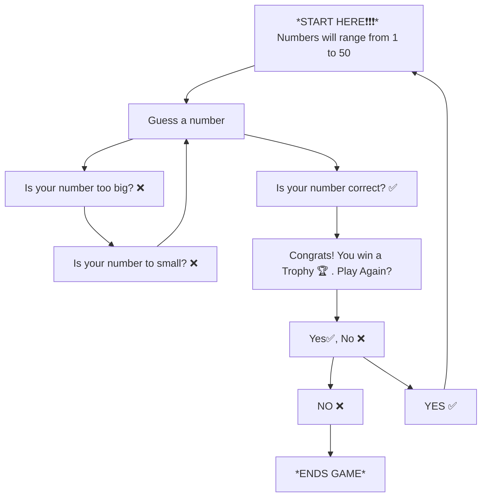

# Guessing Game
FOR MERMAID DIAGRAM ASSIGNMENT

```mermaid
flowchart TD
    A[*START HERE❗❗❗* Numbers will range from 1 to 50] 
    --> B[Guess a number]
    --> C[Is your number too big? ❌]
    --> D[Is your number to small? ❌]
    --> B
    --> E[Is your number correct? ✅]
    --> F[ Congrats! You win a Trophy 🏆 . Play Again?]
    --> G[Yes✅, No ❌]
    --> H[NO ❌]
    H --> I[*ENDS GAME*]
    G --> J[YES ✅]
    J --> A
```